# Relazione

##### *2025, Metodi del Calcolo Scientifico, Riccardo Chimisso 866009 & Mauro Zorzin 866001*

## Indice

1. [Struttura](#struttura)
    1. [Linguaggio](#linguaggio)
    2. [Codice](#codice)
        1. [`dct.py`](#dctpy)
        2. [`app.py`](#apppy)
        3. [`engine.py`](#enginepy)
        4. [Implementazioni](#implementazioni)
    3. [SciPy](#scipy)
        1. [DCT](#dct)
        2. [IDCT](#idct)
    4. [Dati](#dati)
    5. [Test](#test)
    6. [Documentazione](#documentazione)
    7. [CI](#ci)
2. [Confronto DCT2 e FastDCT2](#confronto-dct2-e-fastdct2)
3. [Esperimenti](#esperimenti)
    1. [*F=8; d=10*](#compressione-con-f8-d10)
        1. [80x80](#80x80)
        2. [Prova](#prova)
        3. [Deer](#deer)
        4. [Black Hole](#black-hole)
        5. [Commenti](#commenti)
    2. [*F=32; d=10*](#compressione-con-f32-d10)
        1. [Deer *F=8; d=10*](#deer-f8-d10)
        2. [Deer *F=32; d=10*](#deer-f32-d10)
        3. [Commenti](#commenti-1)
    3. [*F=32; d=40*](#compressione-con-f32-d40)
        1. [Deer *F=8; d=10*](#deer-f8-d10-1)
        2. [Deer *F=32; d=40*](#deer-f32-d40)
        3. [Commenti](#commenti-2)
    4. [Compressioni successive](#compressioni-successive)
        1. [80x80](#80x80-1)
        2. [Deer](#deer-1)
        3. [Commenti](#commenti-3)
    5. [Immagini fortunate](#immagini-fortunate)
        1. [Gradient *F=8; d=1*](#gradient-f8-d1)
        2. [Gradient *F=8; d=3*](#gradient-f8-d3)
        3. [Commenti](#commenti-4)
    6. [Effetto pixelatura](#effetto-pixelatura)
        1. [Black Hole *F=8; d=1*](#black-hole-f8-d1)
        2. [Black Hole *F=16; d=1*](#black-hole-f16-d1)
        3. [Black Hole *F=32; d=1*](#black-hole-f32-d1)
        4. [Black Hole *F=64; d=1*](#black-hole-f64-d1)
        5. [Black Hole *F=128; d=1*](#black-hole-f128-d1)
        6. [Deer *F=8; d=1*](#deer-f8-d1)
        7. [Deer *F=16; d=1*](#deer-f16-d1)
        8. [Deer *F=32; d=1*](#deer-f32-d1)
        9. [Deer *F=64; d=1*](#deer-f64-d1)
        10. [Commenti](#commenti-5)
    7. [Effetto pixelatura con *F* piccolo](#effetto-pixelatura-con-f-piccolo)
        1. [Black Hole *F=4; d=1*](#black-hole-f4-d1)
        2. [Gradient *F=2; d=3*](#black-hole-f2-d1)
        3. [Commenti](#commenti-6)
4. [Sviluppi futuri](#sviluppi-futuri)

## Struttura

*La struttura di questa libreria è molto semplice e descritta di seguito.*  
*Una descrizione più dettagliata di ciascun modulo, classe e metodo è sempre disponibile per l'ultima release all'indirizzo https://rchimisso.github.io/mcs-prog-2/.*

### Linguaggio

Il linguaggio utilizzato è Python, la cui scelta è stata motivata dalla sua semplicità implementativa, ampia diffusione e supporto esteso da parte della comunità scientifica.  
In particolare, le numerose librerie scientifiche già disponibili, come NumPy e SciPy, permettono di sfruttare strutture dati efficienti e operazioni matematiche ottimizzate, facilitando notevolmente l'implementazione e la verifica degli algoritmi.

### Codice

Il codice sorgente di questa libreria è in Python ed è diviso in tre moduli principali: `dct.py`, `app.py` ed `engine.py`.

#### `dct.py`

Questo modulo contiene l'implementazione *naive* della DCT2 e il codice per il confronto delle prestazioni tra DCT2 *naive* e *fast*.

I suoi metodi principali sono `benchmark` e `plot`.  
Il metodo `benchmark` si occupa di confrontare le performance delle due implementazioni della DCT2, ovvero quella *naive* fatta "a mano" e quella *fast* fornita da SciPy, tramite confronto delle loro tempistiche su matrici via via sempre più grandi. Il tempo per ciascuna matrice che risulta del benchmark è il minore tra i vari tentativi che vengono eseguiti in quanto, come da [documentazione](https://docs.python.org/3/library/timeit.html#:~:text=It%E2%80%99s%20tempting%20to,rather%20than%20statistics.), è in genere il valore più rappresentativo.  
Il metodo `plot` si occupa invece di creare il grafico che mostra la relazione tra grandezza delle matrici e tempo impiegato per le esecuzioni delle due implementazioni della DCT2, assieme ai valori teorici che ci si aspetta per entrambe.

#### `app.py`

Questo modulo contiene l'implementazione della compressione JPEG basata su DCT2 e il codice per l'interfaccia grafica che permette di selezionare un'immagine in scala di grigi e successivamente visualizzare passo-passo l'applicazione dell'algoritmo di compressione.

Il metodo `jpeg_pipeline_steps` si occupa di creare gli step da visualizzare una volta che l'immagine selezionata deve essere compressa.  
In totale ci sono 6 step:

1. Immagine original (*Original image*)
2. Immagine ritagliata (*Cropped image*)
3. Visualizzazione dell'applicazione della DCT2 (*|DCT| (log₁₀)*)
4. Visualizzazione dell'applicazione della maschera (*Mask k+ℓ ≥ d_thr*)
5. Immagine ricomposta, e quindi compressa (*IDCT (round & clip 0-255)*)
6. Immagine originale ritagliata e immagine compressa affiancate (*Original vs Compressed images*)

Poiché gli step 3 e 4 non producono valori direttamente visualizzabili in scala di grigi, i risultati vengono passati prima alla funzione `to_visual` che utilizza una scala logaritmica e una normalizzazione lineare per mappare tali valori nell'intervallo $0-255$.  
La scala logaritmica prima della normalizzazione lineare è stata impiegata per risolvere i seguenti problemi:
| Problema                                                                                                                                                                                   | Vantaggio della scala logaritmica                                                                                                    |
|--------------------------------------------------------------------------------------------------------------------------------------------------------------------------------------------|--------------------------------------------------------------------------------------------------------------------------------------|
| Ciascun pixel viene mappato tra 0 e 255 linearmente, quindi valori grandi dominano la scala.                                                                                               | I valori grandi sono "schiacciati" più di quelli piccoli. Piccole differenze diventano visibili.                                     |
| Gli occhi umani rispondono all'incirca logaritmicamente all'intensità luminosa, quindi valori in scala lineare non rispecchiano la percezione di valori a intervalli uguali in luminosità. | Dopo una trasformazione logaritmica, valori numerici uguali corrispondono maggiormente ai intervalli di luminosità percepiti uguali. |

La classe `DCT2App` sfrutta la libreria TKinter per creare una finestra che permetta all'utente di selezionare un'immagine in scala di grigi, comprimerla, e visualizzare gli step precedentemente citati.

#### `engine.py`

Questo modulo contiene la logica per la gestione del programma da linea di comando.

All'avvio, stampa una stringa informativa sulla versione dell'engine e permette di interagire tramite alcuni semplici comandi:

```
info
- Mostra la stringa identificatrice dell'engine e la sua versione.

help
help [command]
- Mostra la lista dei comandi disponibili. Se un comando è specificato, mostra l'aiuto per quel comando.

dct
dct [n]
- Confronta l'implementazione naive della DCT2 con quella di SciPy. Il confronto viene fatto per matrici N×N con N che parte da 2³ e raddoppia fino a 2ⁿ (n è di default impostato a 12).

cmp
- Lancia l'applicazione per selezionare e comprimere un'immagine in scala di grigi con la compressione JPEG.

exit
- Chiude l'engine.
```

L'esecuzione dell'engine è semplicemente composta da un *main loop* che si interrompe solo tramite comando `exit`.  
Per tutti gli altri comandi, viene chiamata la funzione corrispondente che si occupa di gestire il comando ricevuto.

Le gestione dei comandi `dct` e `cmp` viene governata rispettivamente ai due moduli `dct.py` e `app.py` tramite chiamata dei loro metodi principali.

#### Implementazioni

Le implementazioni più interessanti sono quelle della DCT2 *naive* fatta "a mano" e la creazione degli step di visualizzazione della compressione JPEG.

L'implementazione *naive* della DCT2 si compone di due metodi:
```python
def compute_dct_matrix(N: int) -> np.typing.NDArray[Any]:
  # Computa il vettore di scala riga per riga.
  alpha = np.full(N, math.sqrt(2 / N))
  alpha[0] = 1 / math.sqrt(N)
  # Crea il vettore colonna con gli indici da 0 a N-1.
  k = np.arange(N).reshape(-1, 1)
  # Crea il vettore riga con gli indici da 0 a N-1.
  i = np.arange(N).reshape(1, -1)
  # Kernel del coseno broadcastizzato moltiplicato per gli scaling delle righe.
  return alpha[:, None] * np.cos(k * math.pi * (2 * i + 1) / (2 * N))
```
```python
def dct2_naive(data: np.typing.NDArray[Any]) -> np.typing.NDArray[Any]:
  # Computa la matrice ortonormale della DCT2.
  D = compute_dct_matrix(data.shape[0])
  # Usa la matrice D per trasformare le righe e le colonne dell'input.
  return D @ data @ D.T
```

L'implementazione della costruzione della compressione JPEG è fatta da un unico metodo:
```python
def jpeg_pipeline_steps(img: np.typing.NDArray[Any], F: int, d_thr: int) -> tuple[list[np.typing.NDArray[Any] | tuple[np.typing.NDArray[Any], np.typing.NDArray[Any]]], list[str]]:
  if img.ndim != 2:
    raise ValueError("Image must be gray-scale!")

  # Ritaglia l'immagine.
  cropped, width, height = crop(img, F)

  # Crea la maschera per i coefficienti di frequenza in base ai parametri in input (k+ℓ < d_thr).
  k_idx, l_idx = np.meshgrid(np.arange(F), np.arange(F), indexing="ij")
  block_mask = (k_idx + l_idx) < d_thr

  # Inizializza le variabili in cui verranno salvati i vari coefficienti dei diversi step.
  coeff_mag = np.zeros_like(cropped, dtype=float) # Applicazione della DCT2.
  coeff_masked_mag = np.zeros_like(cropped, dtype=float) # Maschera.
  idct_float = np.empty_like(cropped, dtype=float) # Ricostruzione.

  # Per ogni blocco F×F:
  for y in range(0, height, F):
    for x in range(0, width, F):
      # Recupera i valori nel blocco.
      patch = cropped[y : y + F, x : x + F].astype(float)
      # Applica la DCT2.
      c: np.typing.NDArray[Any] = dctn(patch, type=2, norm="ortho")
      # Salva lo snapshot del blocco dopo l'applicazione della DCT2.
      coeff_mag[y : y + F, x : x + F] = c
      # Maschera i coefficienti.
      c_mask = c * block_mask
      # Salva lo snapshot del blocco dopo la maschera.
      coeff_masked_mag[y : y + F, x : x + F] = c_mask
      # Applica la IDCT.
      rec_patch: np.typing.NDArray[Any] = idctn(c_mask, type=2, norm="ortho")
      # Ricostruisci l'immagine.
      idct_float[y : y + F, x : x + F] = np.clip(np.round(rec_patch), 0, 255).astype(np.uint8)

  # Salva in ordine le immagini da visualizzare per ciascuno step.
  images: list[np.typing.NDArray[Any] | tuple[np.typing.NDArray[Any], np.typing.NDArray[Any]]] = [
    img,
    cropped,
    to_visual(coeff_mag),
    to_visual(coeff_masked_mag),
    idct_float,
    (cropped, idct_float)
  ]

  # Salva in ordine i titoli degli step da visualizzare.
  titles = [
    "Original image",
    "Cropped image",
    "|DCT| (log₁₀)",
    f"Mask k+ℓ ≥ {d_thr}",
    "IDCT (round & clip 0-255)",
    "Original vs Compressed images"
  ]

  return images, titles
```

### SciPy

[SciPy](https://scipy.org/) è una libreria Python molto utilizzata in ambito scientifico poiché fornisce un'ampia gamma di algoritmi per l'ottimizzazione, l'integrazione, l'interpolazione, risoluzione di equazioni algebriche e differenziali, statistica, e molto altro.  
Inoltre questi algoritmi sono fortemente ottimizzati e le loro implementazioni sono scritte in linguaggi più a bassi livello come il C++.  
Non solo, ma è anche ben integrato con NumPy, un'altra famosa libreria Python usata in ambito scientifico e non, ed è anche open source.

#### DCT

La funzione usata per avere un'implementazione *fast* della DCT2 è la `dctn` fornita dalla libreria SciPy.  
La funzione `dctn`, fornita da SciPy all'interno del suo modulo `scipy.fft`, è brevemente descritta dalla sua documentazione:

> Restituisce la DCT multidimensionale di tipo arbitrario lungo gli assi specificati.

La versione della DCT fornita da SciPy è calcolata usando alla base la FFT.  
La funzione può inoltre prendere vari parametri in input oltre all'array su cui applicare la DCT.  
Ogni parametro è ben documentato, e la documentazione è facilmente consultabile [sul sito dedicato](https://docs.scipy.org/doc/scipy/reference/generated/scipy.fft.dctn.html).  
Qui approfondiremo brevemente solo i parametri più importanti e quelli utilizzati nel sorgente di questo progetto, e motiveremo le scelte fatte in merito:

- `x`:  
  Dato in input a cui applicare la DCT.

- `s` e `axes`:  
  Restringono l'applicazione della DCT specificando una *shape* del risultato (`s`) o gli assi lungo cui applicarla (`axes`).  
  Nel codice di questo progetto questi parametri non sono specificati, lasciando quindi che la funzione applichi la DCT sull'intero input lungo tutti i suoi assi.

- `norm`:  
  Il suo default è `"backward"`. Quando viene impostata a `"ortho"`, come in questo progetto, la DCT viene ridimensionata in base allo stesso fattore complessivo.  
  Inoltre, quando `norm="ortho"`, la trasformata è anche ortogonalizzata, ovvero la definizione della trasformazione viene modificata per garantire l'ortogonalità della matrice DCT.  
  Più dettagli nella descrizione del parametro `type`.

- `type`:  
  Il tipo della DCT. Di default vale $2$, motivo per cui questo parametro non è esplicitato nel sorgente di questo progetto.  
  Nella libreria è specificato che esistono varie definizioni della DCT2 e che viene usata la seguente (con `norm="backward"`):  
  $y_k=2 \sum_{n=0}^{N-1}x_ncos\left ( \frac{\pi k\left ( 2n+1 \right )}{2N} \right )$  
  Se `orthogonalize=True` (default per `norm="ortho"`), `y[0]`è divisa per $\sqrt{2}$. Quando combinato con `norm="ortho"`, rende la matrice dei coefficienti corrispondente ortonormale (`O @ O.T = I`).

#### IDCT

La funzione usata per avere un'implementazione *fast* della IDCT2 è la `idctn` fornita dalla libreria SciPy.  
Commenti analoghi a quelli fatti per la `dctn` possono essere fatti anche per la `idctn`:

- È basata sulla FFT.
- Restituisce la IDCT multidimensionale di tipo arbitrario lungo gli assi specificati.
- I parametri in input sono pressappoco gli stessi, eccetto per `type` che assume un significato "simmetrico" (più dettagli su questo sotto).
- La documentazione ufficiale è disponibile alla [pagina dedicata](https://docs.scipy.org/doc/scipy/reference/generated/scipy.fft.idct.html#scipy.fft.idct).

Come anticipato, il parametro `type` assume un significato leggermente diverso da quanto visto per la `dctn`.  
Questo è dovuto al fatto che generalmente "la" DCT si riferisce alla DCT2 e "la" DCT Inversa si riferisce alla IDCT2, la quale altro non è che la DCT3.  
Infatti, la IDCT è equivalente a una normale DCT, eccetto per la normalizzazione e il tipo: la DCT2 e la DCT3 sono una l'inversa dell'altra, mentre la DCT1 e la DCT4 sono ognuna la propria inversa.  
La DCT3 ortonormalizzata è precisamente l'inversa della DCT2 ortonormalizzata.

Come per la DCT2, ci sono varie definizioni, e SciPy usa la seguente per la IDCT2 (con `norm="backward"`):  
$y_k=x_0+2 \sum_{n=1}^{N-1}x_ncos\left ( \frac{\pi \left ( 2k+1 \right )n}{2N} \right )$  
Se `orthogonalize=True` (default per `norm="ortho"`), `x[0]`è divisa per $\sqrt{2}$. Quando combinato con `norm="ortho"`, rende la matrice dei coefficienti corrispondente ortonormale (`O @ O.T = I`).

### Dati

All'interno della cartella [data](./data/) sono presenti alcuni file `.bmp`, immagini in scala di grigio, per poter comodamente testare il programma di compressione basato su DCT2.  

### Test

La libreria include un semplice file di test che verifica che entrambe le implementazioni della DCT2, sia $1D$ che $2D$ e sia *naive* che *fast*, rispettino le indicazioni fornite, specificamente sullo scaling.

### Documentazione

La libreria fornisce anche della documentazione dettagliata, oltre a questa relazione.

La documentazione, interamente in inglese, è divisa in:

- `README.md`: contiene una breve descrizione dello scopo del progetto, come impostarlo, come usarlo e brevi descrizioni per gli algoritmi implementati.
- `CHANGELOG.md`: contiene la cronologia delle versioni e dei cambiamenti apportati.
- Sphinx Doc: l'intero codice sorgente è commentato tramite Docstring, le quali vengono poi usate, tramite Sphinx, per costruire documentazione ben formattata che viene poi resa disponibile online all'indirizzo https://rchimisso.github.io/mcs-prog-2/.

### CI

La libreria è hostata su GitHub e sono presenti workflow personalizzati per il rilascio di nuove versioni.

Quando viene effettuato un rilascio:

1. È necessario specificare il nuovo numero di versione, il quale sarà validato per assicurarsi che rispetti il formato corretto e che non sia una regressione.
2. Il codice sorgente viene analizzato tramite Prospector per assicurarsi di mantenere lo stile di scrittura coerente e pulito.
3. Il codice sorgente viene testato tramite i test presenti al fine di evitare regressioni sulle funzionalità.
4. Se tutti i passi precedenti hanno esito positivo, il numero di versione viene aggiornato.
5. Eseguibili per Linux e Windows vengono generati e una nuova release viene creata.
6. Viene costruita la documentazione aggiornata tramite Sphinx e viene pubblicata con GitHub Pages all'indirizzo https://rchimisso.github.io/mcs-prog-2/.

I workflow di cui ai punti 2, 3 e 6 sono eseguibili anche in modo indipendente.

## Confronto DCT2 e FastDCT2

Il confronto tra DCT2 *naive* e DCT2 *fast* è stato fatto per matrici $N \times N$ con $N$ che parte da $2^3$ e raddoppia fino a $2^n$, con $n=15$.  
Il confronto si ferma a $2^15$ per problemi di spazio. La tabella sottostante riporta infatti il consumo teorico solo per la tabella $N \times N$ da inizializzare:

|   $n$ | Lato $N = 2^n$ | Valori $V = 2^{2n}$ |      `float64` MB |      `float64` GB |
| ----: | -------------: | ------------------: | ----------------: | ----------------: |
|   $3$ |            $8$ |                $64$ | $\frac{1}{2,048}$ |              $≈0$ |
|   $4$ |           $16$ |               $256$ |   $\frac{1}{512}$ |              $≈0$ |
|   $5$ |           $32$ |             $1,024$ |   $\frac{1}{128}$ |              $≈0$ |
|   $6$ |           $64$ |             $4,096$ |    $\frac{1}{32}$ |              $≈0$ |
|   $7$ |          $128$ |            $16,384$ |     $\frac{1}{8}$ | $\frac{1}{8,192}$ |
|   $8$ |          $256$ |            $65,536$ |     $\frac{1}{2}$ | $\frac{1}{2,048}$ |
|   $9$ |          $512$ |           $262,114$ |               $2$ |   $\frac{1}{512}$ |
|  $10$ |        $1,024$ |         $1,048,576$ |               $8$ |   $\frac{1}{128}$ |
|  $11$ |        $2,048$ |         $4,194,304$ |              $32$ |    $\frac{1}{32}$ |
|  $12$ |        $4,096$ |        $16,777,216$ |             $128$ |     $\frac{1}{8}$ |
|  $13$ |        $8,192$ |        $67,108,864$ |             $512$ |     $\frac{1}{2}$ |
|  $14$ |       $16,384$ |       $268,435,456$ |           $2,048$ |               $2$ |
|  $15$ |       $32,768$ |     $1,073,741,824$ |           $8,192$ |               $8$ |
|  $16$ |       $65,536$ |     $4,294,967,296$ |          $32,768$ |              $32$ |
|  $17$ |      $131,072$ |    $17,179,869,184$ |         $131,072$ |             $128$ |

$\frac{\left ( 2^n \right )^2 \cdot 64}{8 \cdot 2^S} = \frac{2^{2n} \cdot 8}{2^S} = 2^{2n+3-S}$ dove $S$ è la dimensione dell'unità di misura ($20$ per MB e $30$ per GB).

Oltre alla tabella di dati, però, sono necessarie matrici ausiliarie di dimensioni analoghe per il calcolo della DCT, aumentando quindi l'effettiva memoria occupata.  
Motivo per cui, con $n=15$ vediamo in memoria un picco di utilizzo a $≈32$ GB. Poiché il computer su cui il programma gira ha $64$ GB di RAM, sarebbe stato improponibile effettuare confronti per qualsiasi $n \ge 16$.

I risultati del benchmark sono i seguenti:

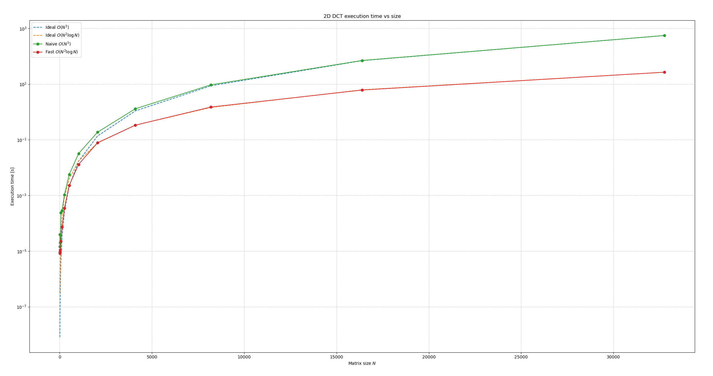

|        N |      *naive* |               $N^3$ |      *fast* | $N^2 \cdot \log_2 N$ |
| -------: | -----------: | ------------------: | ----------: | -------------------: |
|      $8$ |   $0.000039$ | $8.1\mathrm{e}{-9}$ |  $0.000009$ |  $3.2\mathrm{e}{-7}$ |
|     $16$ |   $0.000014$ | $6.5\mathrm{e}{-8}$ |  $0.000008$ |  $1.7\mathrm{e}{-6}$ |
|     $32$ |   $0.000020$ | $5.2\mathrm{e}{-7}$ |  $0.000011$ |           $0.000009$ |
|     $64$ |   $0.000239$ |          $0.000004$ |  $0.000023$ |           $0.000041$ |
|    $128$ |   $0.000288$ |          $0.000033$ |  $0.000074$ |           $0.000191$ |
|    $256$ |   $0.001054$ |          $0.000266$ |  $0.000348$ |           $0.000873$ |
|    $512$ |   $0.005642$ |          $0.002128$ |  $0.002276$ |           $0.003927$ |
|  $1,024$ |   $0.032001$ |          $0.017023$ |  $0.013081$ |           $0.017452$ |
|  $2,048$ |   $0.187117$ |          $0.136189$ |  $0.078109$ |           $0.076788$ |
|  $4,096$ |   $1.300700$ |          $1.089513$ |  $0.335374$ |           $0.335076$ |
|  $8,192$ |   $9.434609$ |          $8.716108$ |  $1.500139$ |           $1.451994$ |
| $16,384$ |  $70.759652$ |         $69.728862$ |  $6.130185$ |           $6.254744$ |
| $32,768$ | $557.830893$ |        $557.830893$ | $26.806044$ |          $26.806044$ |

Nel confronto fra DCT2 *naive* ($O(N^{3})$) e DCT2 *fast* ($O(N^{2}\log N)$), per visualizzare le pendenze, abbiamo normalizzato le curve teoriche asintotiche moltiplicandole per il tempo effettivo sull’ultima dimensione, cosicché le linee coincidessero in quel punto e l’occhio potesse cogliere subito se le misure coincidessero o divergessero. I tempi degli asintoti riportati in tabella sono infatti quelli già scalati.  
È subito evidente come l'implementazione *fast* sia sempre migliore di quella *naive*.  

Si può anche notare come per le matrici molto piccole ($N<64$), i tempi non seguono fin da subito il limite asintotico, bensì sono pressappoco equivalenti.  
Questo è dovuto al fatto che per le matrici più piccole le costanti nascoste prendono il sopravvento.

È interessante anche come l'implementazione *fast* risulti stare sotto la curva normalizzata del suo asintotico teorico per molte matrici.  
Questo suggerisce che le costanti moltiplicative nascoste del regime più grande siano maggiori di quelle "globali", cosa che potrebbe essere dovuta a overhead di parallelizzazione (SciPy automaticamente determina il numero di thread da usare in base alla dimensione della matrice), costi di setup maggiori, ecc. Matrici più piccole stanno anche più facilmente nella cache della CPU.

In conclusione, le implementazioni sembrano allinearsi bene con i limiti asintotici teorici, e l'implementazione *fast* si conferma migliore della versione *naive*.

## Esperimenti

Gli esperimenti riportati sono stati fatti per illustrare gli effetti della compressione JPEG al variare dei parametri $F$, dimensione dei blocchi, e $d$, soglia di cancellazione.

Le immagini che mostrano gli step di compressione sono sempre in ordine: immagine ritagliata in base alla dimensione dei blocchi (*Step 1*), applicazione della DCT2 (*Step 2*), taglio delle frequenze in base alla soglia di cancellazione (*Step 3*), ricostruzione dell'immagine tramite IDCT2 (*Step 4*).  
Cliccando su un'immagine verrà aperta l'immagine corrispondente per consentire una visualizzazione più dettagliata.

### Compressione con $F=8; d=10$

In questa serie di esperimenti, $F$ e $d$ sono stati lasciati ai loro valori di default, rispettivamente $8$ e $10$.

#### 80x80

[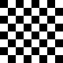](./assets/80x80_step_1_8_10.bmp "80x80 Step 1 F=8 d=10")
[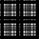](./assets/80x80_step_2_8_10.bmp "80x80 Step 2 F=8 d=10")
[](./assets/80x80_step_3_8_10.bmp "80x80 Step 3 F=8 d=10")
[](./assets/80x80_step_4_8_10.bmp "80x80 Step 4 F=8 d=10")

#### Prova

[](./assets/prova_step_1_8_10.bmp "Prova Step 1 F=8 d=10")
[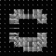](./assets/prova_step_2_8_10.bmp "Prova Step 2 F=8 d=10")
[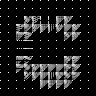](./assets/prova_step_3_8_10.bmp "Prova Step 3 F=8 d=10")
[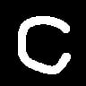](./assets/prova_step_4_8_10.bmp "Prova Step 4 F=8 d=10")

#### Deer

<a href="./assets/deer_step_1_8_10.bmp">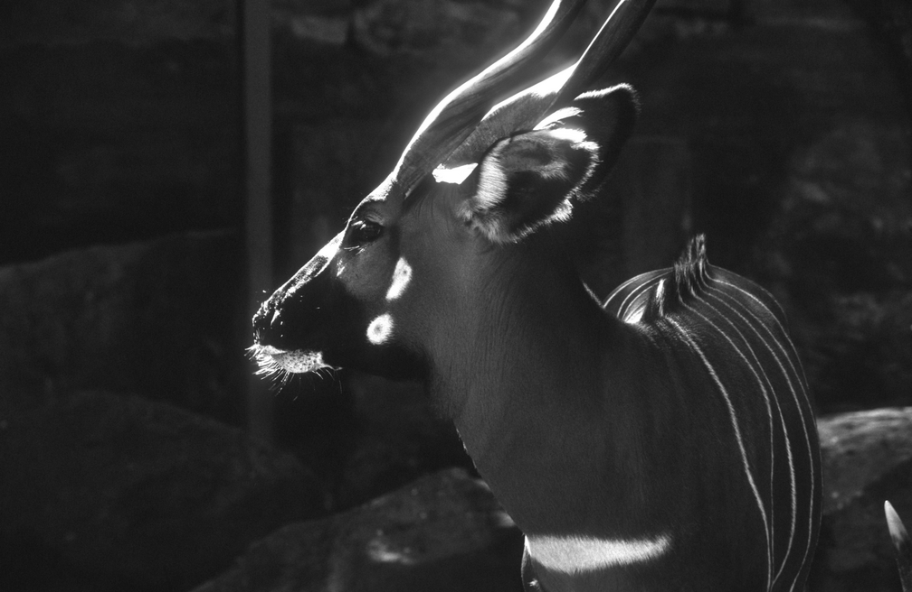</a> <a href="./assets/deer_step_2_8_10.bmp">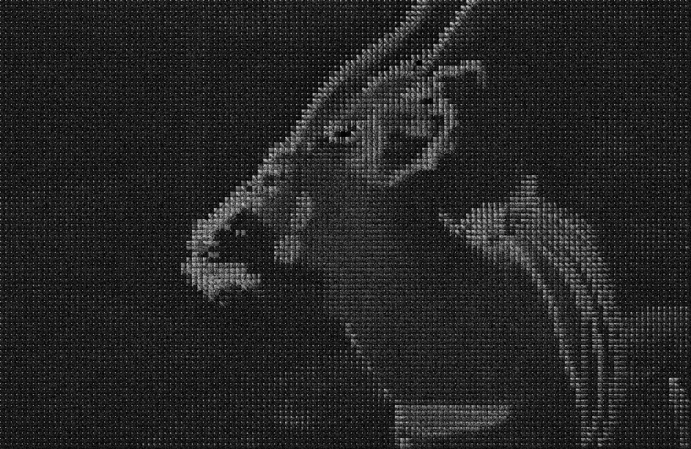</a> <a href="./assets/deer_step_3_8_10.bmp"></a> <a href="./assets/deer_step_4_8_10.bmp"></a>

#### Black Hole

<a href="./assets/Black%20Hole%20Magnetic%20Field_step_1_8_10.bmp"></a> <a href="./assets/Black%20Hole%20Magnetic%20Field_step_2_8_10.bmp"></a> <a href="./assets/Black%20Hole%20Magnetic%20Field_step_3_8_10.bmp"></a> <a href="./assets/Black%20Hole%20Magnetic%20Field_step_4_8_10.bmp"></a>

#### Commenti

In tutte le immagini è visibile un leggero deterioramento della qualità: nelle prime due si formano degli "aloni grigi", nella terza aumenta leggermente la sfocatura, mentre nell'ultima si vengono a formare degli artefatti neri nella regione più luminosa dell'immagine.  
Questo è dovuto alla soglia di cancellazione relativamente aggressiva che è stata scelta, infatti è visibile come al terzo step, quello del taglio delle frequenze, in tutte le immagini i blocchi vadano a perdere molti pixel luminosi, ovvero frequenze rilevanti.  
Interessante è la quarta immagine, quella del buco nero, dove non c'è quasi alcuna perdita di qualità, infatti la maggioranza dei blocchi non perde quasi nulla nel taglio delle frequenze, tranne proprio per le zone più luminose dove i blocchi subiscono una perdita rilevante e nella ricostruzione si vengono a formare quegli artefatti neri.

### Compressione con $F=32; d=10$

In questo esperimento si mette a confronto un'immagine usata nel primo esperimento con la medesima, ma compressa con una dimensione dei blocchi superiore.  
Il valore di $F$ è stato quadruplicato rispetto a prima, passando da $8$ a $32$.

#### Deer $F=8; d=10$

<a href="./assets/deer_step_1_8_10.bmp"></a> <a href="./assets/deer_step_2_8_10.bmp"></a> <a href="./assets/deer_step_3_8_10.bmp"></a> <a href="./assets/deer_step_4_8_10.bmp"></a>

#### Deer $F=32; d=10$

<a href="./assets/deer_step_1_32_10.bmp">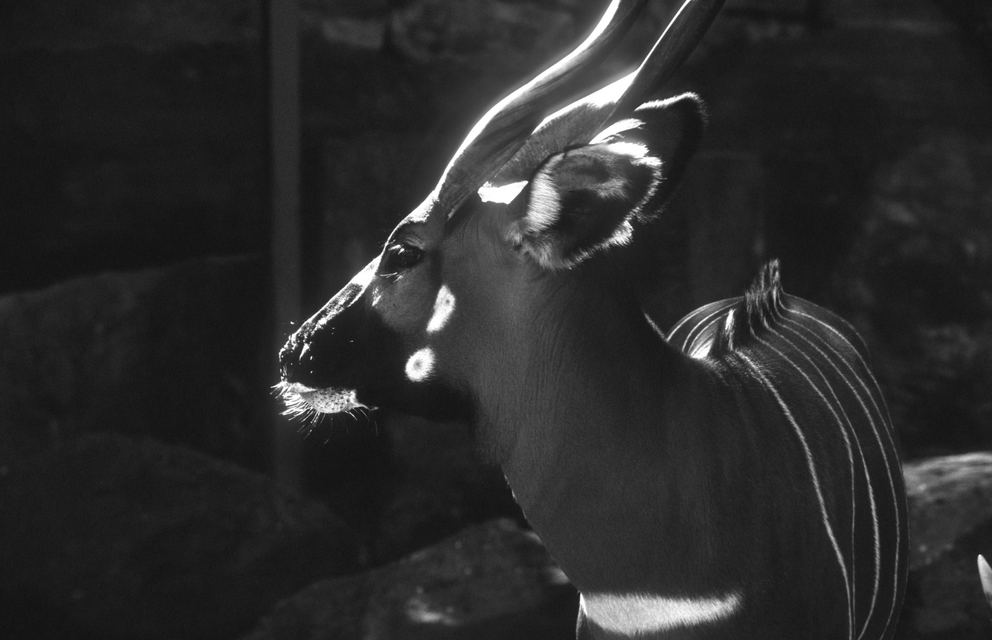</a> <a href="./assets/deer_step_2_32_10.bmp">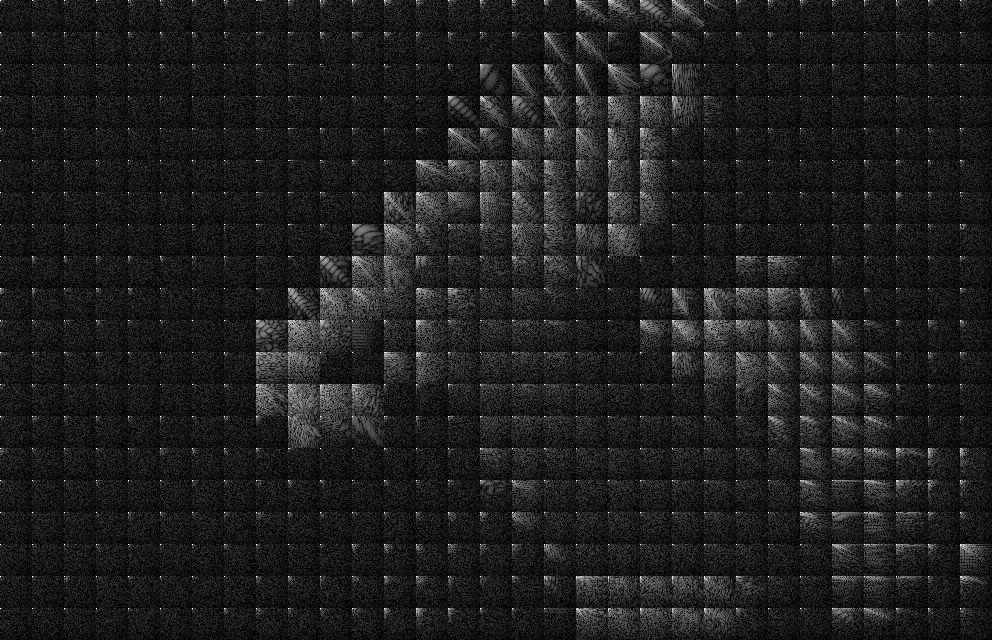</a> <a href="./assets/deer_step_3_32_10.bmp">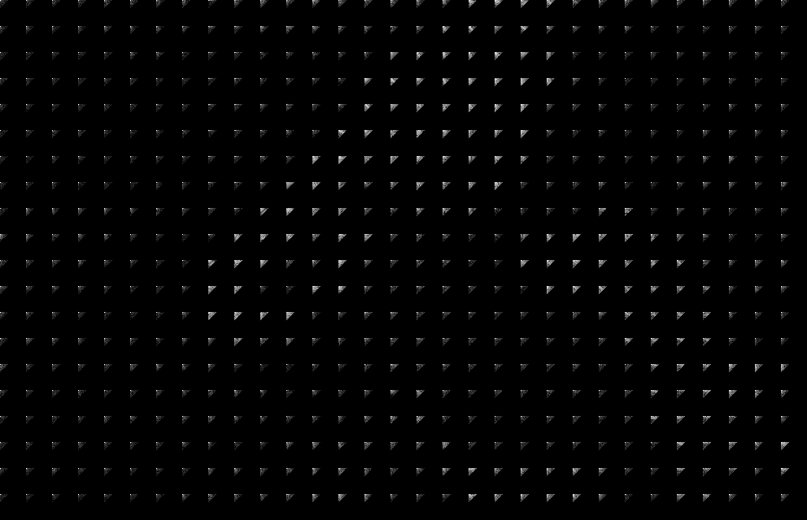</a> <a href="./assets/deer_step_4_32_10.bmp"></a>

#### Commenti

Come ci si aspettava, la perdita in qualità è decisamente maggiore, così come la formazione di artefatti.  
Infatti, aumentando la dimensione dei blocchi, ma lasciando il medesimo valore di soglia, si vanno a perdere molte più informazioni per ciascun blocco.

### Compressione con $F=32; d=40$

In questo esperimento si mette a confronto un'immagine usata nel primo esperimento con la medesima, ma compressa sia con una dimensione dei blocchi superiore che con una soglia di cancellazione maggiore.  
Il valore di $F$ è stato quadruplicato, passando da $8$ a $32$, e la stessa proporzione è stata usata per determinare il nuovo valore di $d$, che aumenta da $10$ a $40$.

#### Deer $F=8; d=10$

<a href="./assets/deer_step_1_8_10.bmp"></a> <a href="./assets/deer_step_2_8_10.bmp"></a> <a href="./assets/deer_step_3_8_10.bmp"></a> <a href="./assets/deer_step_4_8_10.bmp"></a>

#### Deer $F=32; d=40$

<a href="./assets/deer_step_1_32_40.bmp"></a> <a href="./assets/deer_step_2_32_40.bmp"></a> <a href="./assets/deer_step_3_32_40.bmp">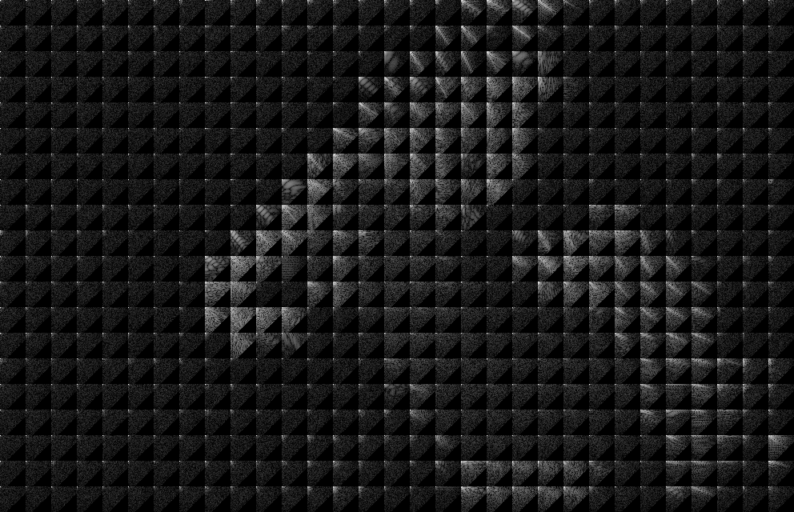</a> <a href="./assets/deer_step_4_32_40.bmp"></a>

#### Commenti

In questo caso le due immagini compresse sono praticamente identiche tra loro. Infatti, aumentando proporzionalmente $F$ e $d$, la quantità di informazioni perse è pressappoco la stessa.

### Compressioni successive

In questa serie di esperimenti, l'algoritmo di compressione è stato applicato più volte in successione alle stesse immagine, mantenendo per tutte le iterazioni i medesimi valori di $F=8$ e $d=10$.

#### 80x80 

[](./assets/80x80_step_1_8_10.bmp "80x80 Step 1.1 F=8 d=10")
[](./assets/80x80_step_2_8_10.bmp "80x80 Step 1.2 F=8 d=10")
[](./assets/80x80_step_3_8_10.bmp "80x80 Step 1.3 F=8 d=10")
[](./assets/80x80_step_4_8_10.bmp "80x80 Step 1.4 F=8 d=10")

[](./assets/80x80_step_4_8_10_step_1_8_10.bmp "80x80 Step 2.1 F=8 d=10")
[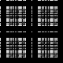](./assets/80x80_step_4_8_10_step_2_8_10.bmp "80x80 Step 2.2 F=8 d=10")
[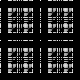](./assets/80x80_step_4_8_10_step_3_8_10.bmp "80x80 Step 2.3 F=8 d=10")
[](./assets/80x80_step_4_8_10_step_4_8_10.bmp "80x80 Step 2.4 F=8 d=10")

[](./assets/80x80_step_4_8_10_step_4_8_10_step_1_8_10.bmp "80x80 Step 3.1 F=8 d=10")
[](./assets/80x80_step_4_8_10_step_4_8_10_step_1_8_10.bmp "80x80 Step 3.2 F=8 d=10")
[](./assets/80x80_step_4_8_10_step_4_8_10_step_1_8_10.bmp "80x80 Step 3.3 F=8 d=10")
[](./assets/80x80_step_4_8_10_step_4_8_10_step_1_8_10.bmp "80x80 Step 3.4 F=8 d=10")

#### Deer

<a href="./assets/deer_step_1_8_10.bmp"></a> <a href="./assets/deer_step_2_8_10.bmp"></a> <a href="./assets/deer_step_3_8_10.bmp"></a> <a href="./assets/deer_step_4_8_10.bmp"></a>

<a href="./assets/deer_step_4_8_10_step_1_8_10.bmp"></a> <a href="./assets/deer_step_4_8_10_step_2_8_10.bmp"></a> <a href="./assets/deer_step_4_8_10_step_3_8_10.bmp">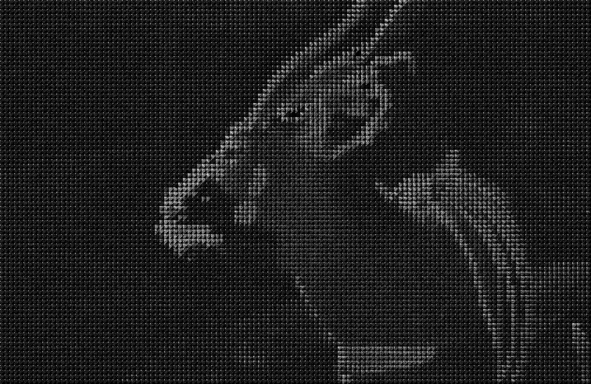</a> <a href="./assets/deer_step_4_8_10_step_4_8_10.bmp"></a>

<a href="./assets/deer_step_4_8_10_step_4_8_10_step_1_8_10.bmp"></a> <a href="./assets/deer_step_4_8_10_step_4_8_10_step_2_8_10.bmp">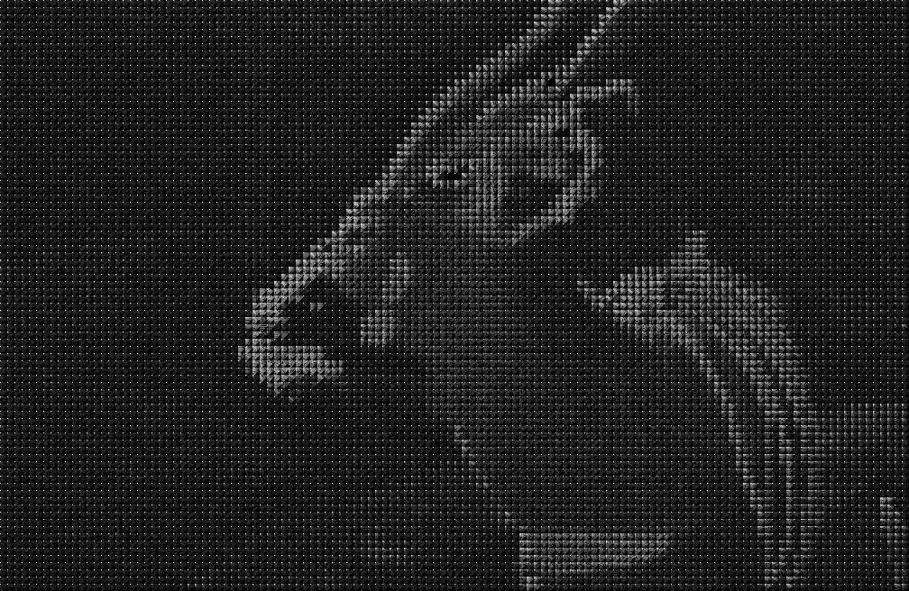</a> <a href="./assets/deer_step_4_8_10_step_4_8_10_step_3_8_10.bmp"></a> <a href="./assets/deer_step_4_8_10_step_4_8_10_step_4_8_10.bmp"></a>

#### Commenti

TODO

### Immagini fortunate

In questo esperimento è stata selezionata un'immagine particolarmente "fortunata" per illustrare come certe immagini possano essere più o meno sensibili al taglio delle frequenze.

#### Gradient $F=8; d=1$

<a href="./assets/gradient_step_1_8_1.bmp"></a> <a href="./assets/gradient_step_2_8_1.bmp"></a> <a href="./assets/gradient_step_3_8_1.bmp"></a> <a href="./assets/gradient_step_4_8_1.bmp">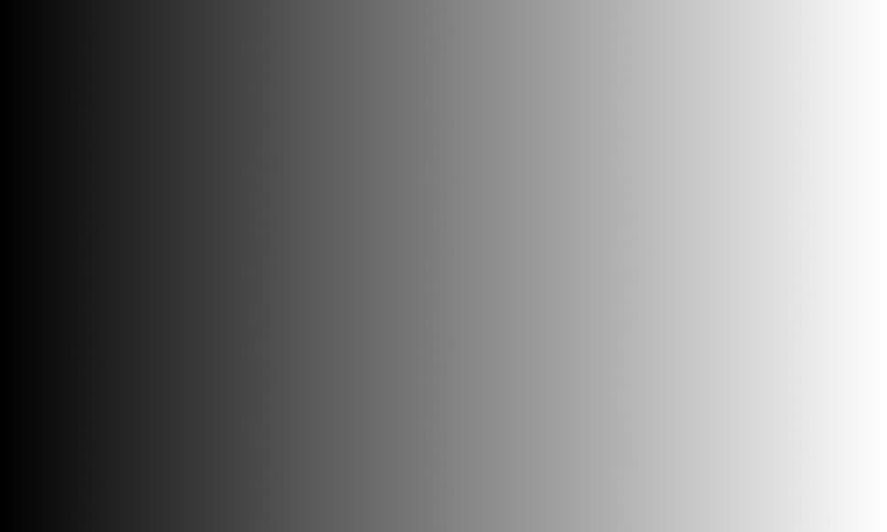</a>

#### Gradient $F=8; d=3$

<a href="./assets/gradient_step_1_8_3.bmp"></a> <a href="./assets/gradient_step_2_8_3.bmp"></a> <a href="./assets/gradient_step_3_8_3.bmp"></a> <a href="./assets/gradient_step_4_8_3.bmp"></a>

#### Commenti

TODO

### Effetto pixelatura

In questa serie di esperimenti, è stato mantenuta la soglia di cancellazione $d$ fissa a $1$ mentre si aumentava progressivamente il valore di $F$, raddoppiandolo di volta in volta.

#### Black Hole $F=8; d=1$

<a href="./assets/Black%20Hole%20Magnetic%20Field_step_1_8_1.bmp"></a> <a href="./assets/Black%20Hole%20Magnetic%20Field_step_2_8_1.bmp"></a> <a href="./assets/Black%20Hole%20Magnetic%20Field_step_3_8_1.bmp"></a> <a href="./assets/Black%20Hole%20Magnetic%20Field_step_4_8_1.bmp"></a>

#### Black Hole $F=16; d=1$

<a href="./assets/Black%20Hole%20Magnetic%20Field_step_1_16_1.bmp"></a> <a href="./assets/Black%20Hole%20Magnetic%20Field_step_2_16_1.bmp"></a> <a href="./assets/Black%20Hole%20Magnetic%20Field_step_3_16_1.bmp"></a> <a href="./assets/Black%20Hole%20Magnetic%20Field_step_4_16_1.bmp"></a>

#### Black Hole $F=32; d=1$

<a href="./assets/Black%20Hole%20Magnetic%20Field_step_1_32_1.bmp"></a> <a href="./assets/Black%20Hole%20Magnetic%20Field_step_2_32_1.bmp"></a> <a href="./assets/Black%20Hole%20Magnetic%20Field_step_3_32_1.bmp"></a> <a href="./assets/Black%20Hole%20Magnetic%20Field_step_4_32_1.bmp"></a>

#### Black Hole $F=64; d=1$

<a href="./assets/Black%20Hole%20Magnetic%20Field_step_1_64_1.bmp"></a> <a href="./assets/Black%20Hole%20Magnetic%20Field_step_2_64_1.bmp"></a> <a href="./assets/Black%20Hole%20Magnetic%20Field_step_3_64_1.bmp"></a> <a href="./assets/Black%20Hole%20Magnetic%20Field_step_4_64_1.bmp"></a>

#### Black Hole $F=128; d=1$

<a href="./assets/Black%20Hole%20Magnetic%20Field_step_1_128_1.bmp"></a> <a href="./assets/Black%20Hole%20Magnetic%20Field_step_2_128_1.bmp"></a> <a href="./assets/Black%20Hole%20Magnetic%20Field_step_3_128_1.bmp"></a> <a href="./assets/Black%20Hole%20Magnetic%20Field_step_4_128_1.bmp"></a>

#### Deer $F=8; d=1$

<a href="./assets/deer_step_1_8_1.bmp"></a> <a href="./assets/deer_step_2_8_1.bmp"></a> <a href="./assets/deer_step_3_8_1.bmp"></a> <a href="./assets/deer_step_4_8_1.bmp"></a>

#### Deer $F=16; d=1$

<a href="./assets/deer_step_1_16_1.bmp"></a> <a href="./assets/deer_step_2_16_1.bmp">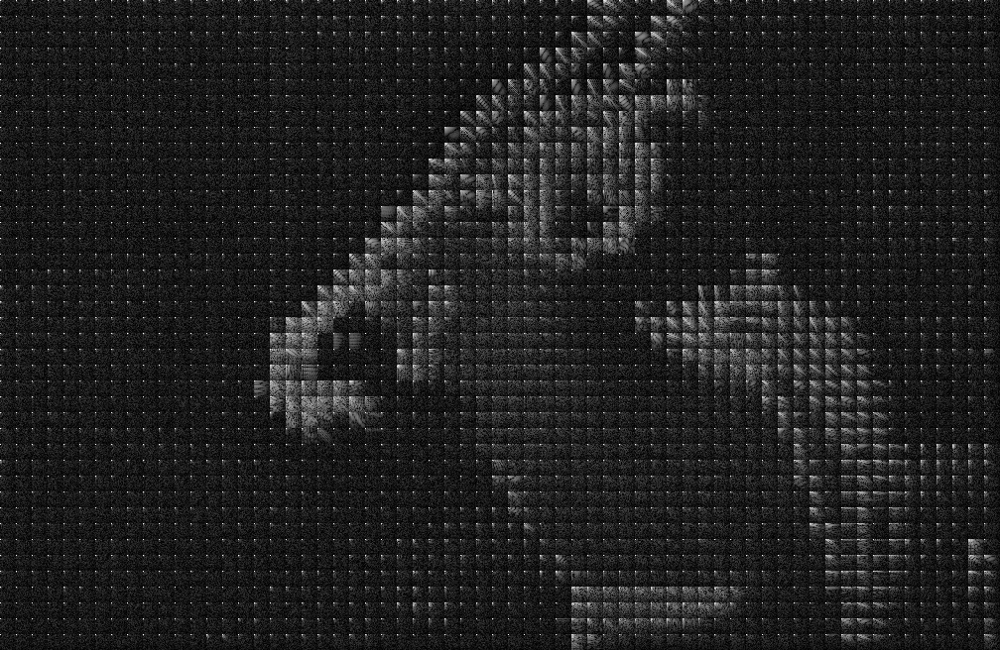</a> <a href="./assets/deer_step_3_16_1.bmp"></a> <a href="./assets/deer_step_4_16_1.bmp"></a>

#### Deer $F=32; d=1$

<a href="./assets/deer_step_1_32_1.bmp"></a> <a href="./assets/deer_step_2_32_1.bmp"></a> <a href="./assets/deer_step_3_32_1.bmp"></a> <a href="./assets/deer_step_4_32_1.bmp">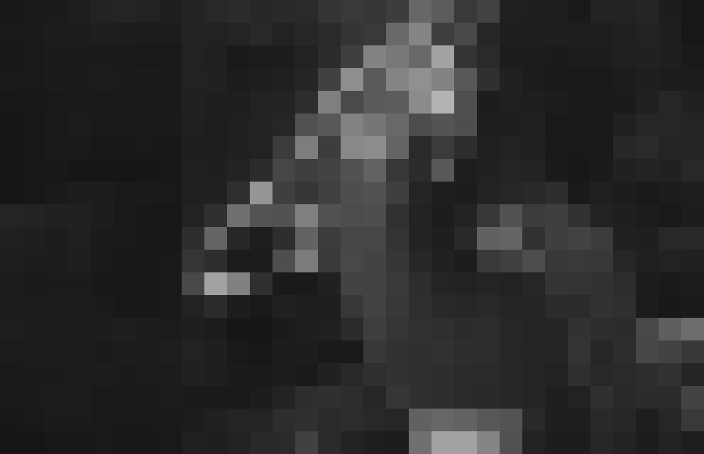</a>

#### Deer $F=64; d=1$

<a href="./assets/deer_step_1_64_1.bmp">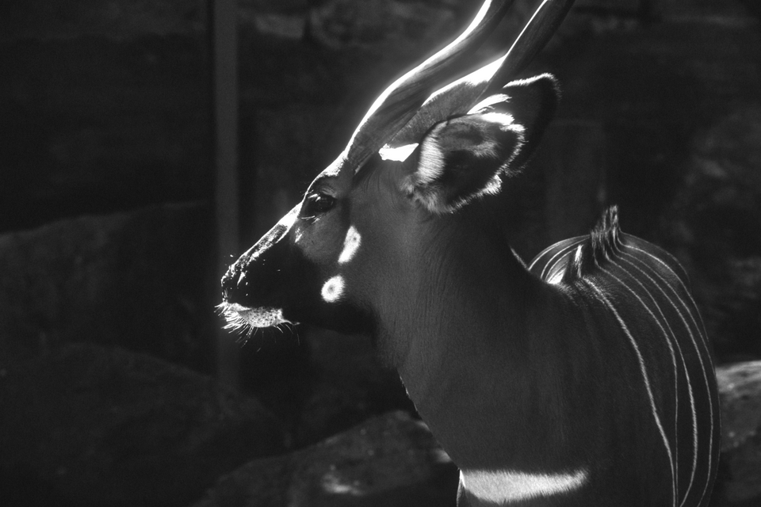</a> <a href="./assets/deer_step_2_64_1.bmp">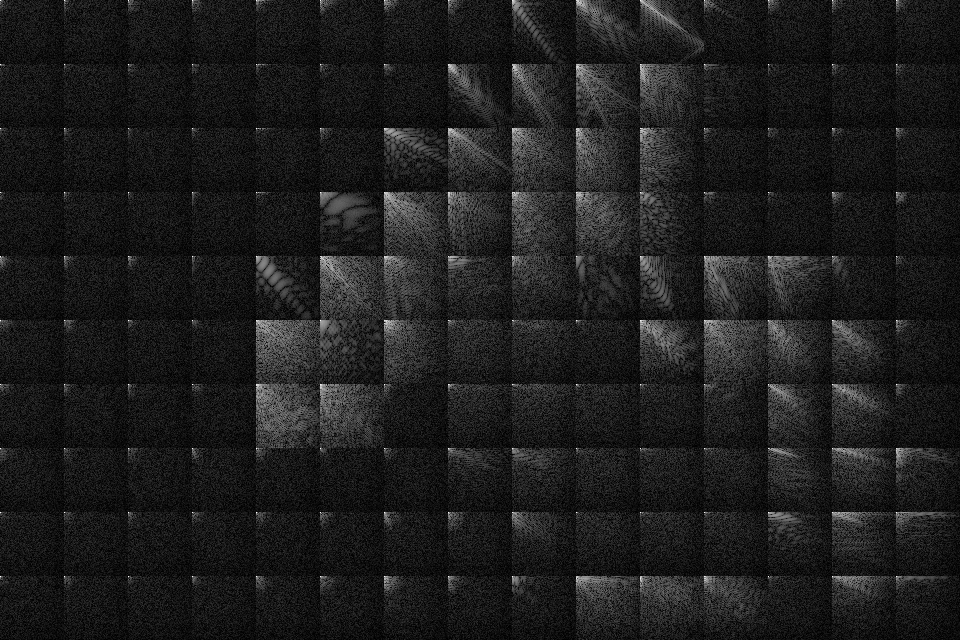</a> <a href="./assets/deer_step_3_64_1.bmp">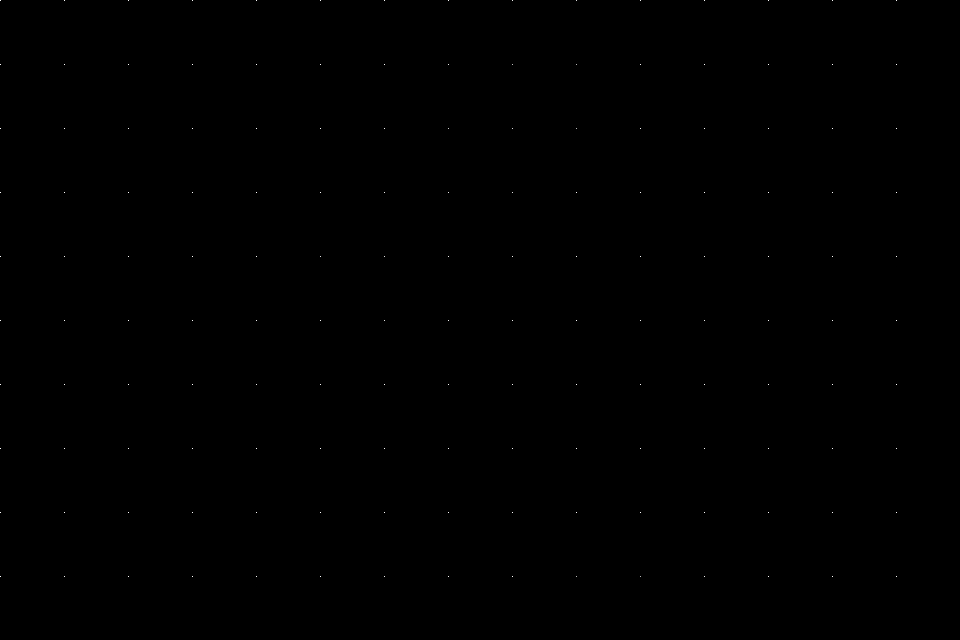</a> <a href="./assets/deer_step_4_64_1.bmp">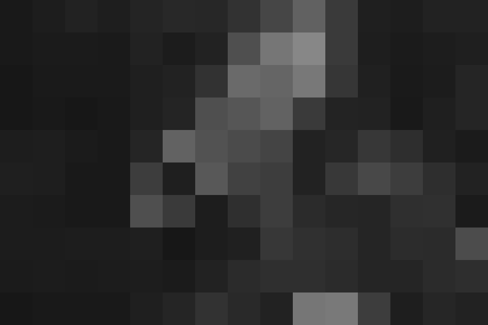</a>

#### Commenti

TODO

### Effetto pixelatura con $F$ piccolo

Come nell'esperimento precedente, si è qui tenuto $d=1$.  
Tuttavia, la grandezza dei blocchi $F$ è stata ridotta a valori molto piccoli, nello specifico $4$ e $2$.

#### Black Hole $F=4; d=1$

<a href="./assets/Black%20Hole%20Magnetic%20Field_step_1_4_1.bmp"></a> <a href="./assets/Black%20Hole%20Magnetic%20Field_step_2_4_1.bmp"></a> <a href="./assets/Black%20Hole%20Magnetic%20Field_step_3_4_1.bmp"></a> <a href="./assets/Black%20Hole%20Magnetic%20Field_step_4_4_1.bmp"></a>

#### Black Hole $F=2; d=1$

<a href="./assets/Black%20Hole%20Magnetic%20Field_step_1_2_1.bmp"></a> <a href="./assets/Black%20Hole%20Magnetic%20Field_step_2_2_1.bmp"></a> <a href="./assets/Black%20Hole%20Magnetic%20Field_step_3_2_1.bmp"></a> <a href="./assets/Black%20Hole%20Magnetic%20Field_step_4_2_1.bmp"></a>

#### Commenti

TODO

## Sviluppi futuri

- Ottimizzare la funzione di benchmark delle implementazioni della DCT in modo da ridurre lo spazio in memoria e permettere confronti per matrici più grandi.
- Automatizzare il download degli step di compressione JPEG da linea di comando in modo da evitare la ripetizione dell'interazione manuale con l'applicazione. 
- Aggiungere la matrice di quantizzazione nella compressione JPEG.
